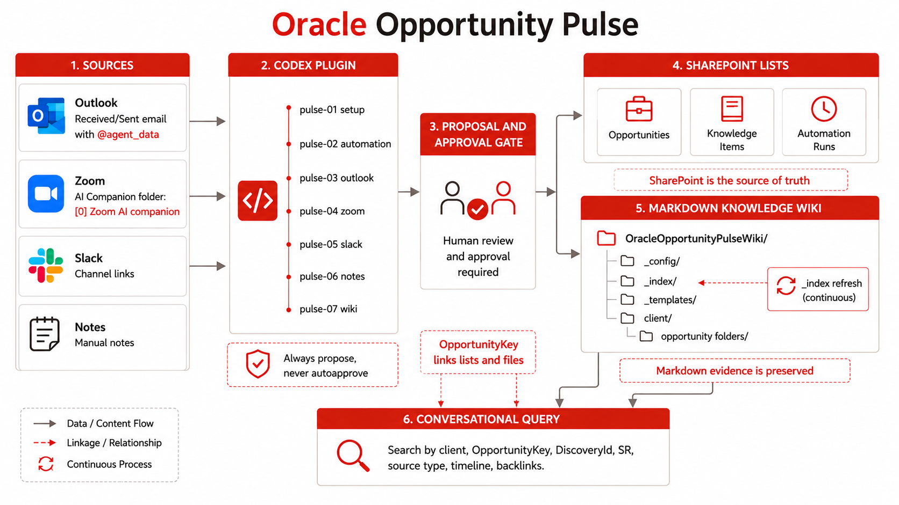
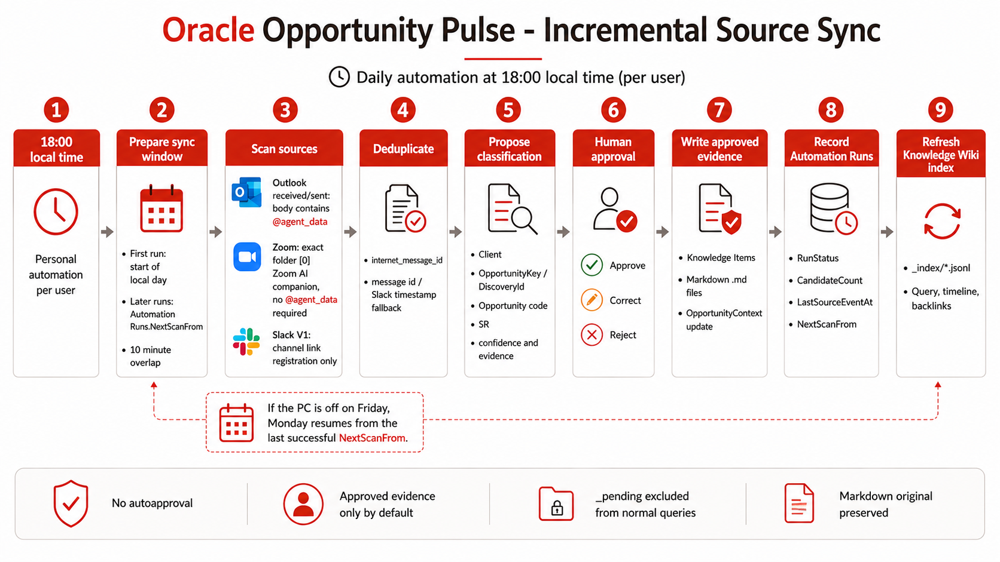

# Oracle Opportunity Pulse for Codex

Codex marketplace repository for installing the `oracle-opportunity-pulse` plugin, shown in Codex as Oracle Opportunity Pulse.

Oracle Opportunity Pulse centralizes opportunity signals from Outlook, Zoom, Slack channel links, and manual notes. Codex proposes the client, opportunity, SR, source type, and evidence; a human approves or corrects the proposal; then approved information is stored in normalized SharePoint lists and preserved as Markdown evidence in a SharePoint-backed Knowledge Wiki.

Daily synchronization is personal per user. At 18:00 local time, the automation scans from the last successful `Automation Runs.NextScanFrom`, applies the right rule per source, deduplicates events, proposes classifications, records the run, and refreshes the wiki index after approved evidence is stored.

For the Spanish operator guide, see [`docs/operator-guide-es.md`](docs/operator-guide-es.md).

## `pulse-00-orchestrator` Skill

`pulse-00-orchestrator` is the main orchestration entry point. It coordinates opportunity registration, source capture, approval, Markdown evidence paths, Knowledge Items, and Knowledge Wiki queries. It keeps `OpportunityKey` as the stable join key so early discovery can start before an official opportunity code or SR exists.

## `pulse-01-setup` Skill

`pulse-01-setup` is the guided installer and connector for Oracle Opportunity Pulse. It supports `install_new` for a new shared SharePoint Pulse and `connect_existing` for users joining an existing Pulse. It creates or validates the `Opportunities`, `Knowledge Items`, and `Automation Runs` list payloads, root folders, `_config/pulse-profile.json`, `_index`, `_templates`, pending queues, and per-opportunity folder structures. It owns structure; the wiki skill owns indexing and query.

## `pulse-02-automation` Skill

`pulse-02-automation` validates the active Pulse connection and prepares each user's personal daily Codex automation. The default schedule is 18:00 in the user's IANA timezone. The automation scans since the last successful run for that user/source/direction, proposes candidates, records `Automation Runs` audit/watermark rows, and waits for approval before final SharePoint evidence writes.

## Source Capture Skills

`pulse-03-outlook` scans received and sent Outlook messages inside the incremental sync window whose body contains `@agent_data`, proposes opportunity classification, and waits for approval before storing evidence.

`pulse-04-zoom` scans every message inside the incremental sync window from the exact Outlook folder `[0] Zoom AI companion`, treats valid messages as Zoom transcript evidence, and keeps transcripts unchanged. Zoom does not require `@agent_data`.

`pulse-05-slack` registers Slack channel links as `SourceType = Slack`. V1 stores the link only and does not claim Slack message reads unless a Slack API connector/token is explicitly available.

`pulse-06-notes` adds manual Markdown notes to an existing opportunity by `OpportunityKey`, `DiscoveryId`, opportunity code, SR, or client name.

After any approved source content is written to SharePoint, refresh the Knowledge Wiki index before relying on wiki search.

## `pulse-07-wiki` Skill

`pulse-07-wiki` maintains and queries the SharePoint-backed Knowledge Wiki. It configures the wiki location, refreshes `_index/*.jsonl`, ranks evidence, warns on stale or metadata-only results, returns opportunity timelines, resolves backlinks, and suggests portable relative Markdown links.

## `pulse-99-test` Skill

`pulse-99-test` validates connector readiness and runs the end-to-end smoke path across setup, ingestion planning, index refresh, and wiki query.

## Knowledge Wiki Layout

The SharePoint document library is organized as a portable Markdown wiki:

    OracleOpportunityPulseWiki/
      _config/
        pulse-profile.json
      _index/
        opportunities.jsonl
        knowledge-items.jsonl
        documents.jsonl
        backlinks.jsonl
        tags.jsonl
        last-refresh.json
      _templates/
        opportunity-readme.md
        context.md
        meeting-note.md
        email-capture.md
        slack-channel.md
        manual-note.md
      _pending/
        outlook/{yyyy-mm-dd}/received/
        outlook/{yyyy-mm-dd}/sent/
        zoom/{yyyy-mm-dd}/
      {ClientName}/
        {OpportunityKey}/
          README.md
          context.md
          zoom/
          outlook/received/
          outlook/sent/
          slack/
          notes/
          attachments/

The `_index` folder is rebuildable from SharePoint lists and Markdown snapshots. SharePoint remains the source of truth.

## Releases

Release notes are maintained on GitHub Releases:

    https://github.com/jgangini/codex-plugin-oracle-opportunity-pulse/releases

## Install From GitHub

Users can add the marketplace with any of these forms:

    codex plugin marketplace add jgangini/codex-plugin-oracle-opportunity-pulse
    codex plugin marketplace add jgangini/codex-plugin-oracle-opportunity-pulse@v1.0.2
    codex plugin marketplace add https://github.com/jgangini/codex-plugin-oracle-opportunity-pulse.git

For local testing before publishing:

    git clone https://github.com/jgangini/codex-plugin-oracle-opportunity-pulse.git
    cd codex-plugin-oracle-opportunity-pulse
    codex plugin marketplace add .

Then open Codex, find Oracle Opportunity Pulse in the plugin list, install it if needed, and start a new thread so the plugin skills and MCP tools are loaded.

## Upgrade

    codex plugin marketplace upgrade oracle-opportunity-pulse

Pinned installs can be upgraded by changing the Git ref, for example from `v1.0.1` to `v1.0.2`, a newer release tag, or `main`.

## Evidence And Governance Standard

Oracle Opportunity Pulse separates source evidence, classification, approval, and wiki query:

    {
      "source_type": "Zoom|Outlook|Slack|Notes",
      "direction": "Received|Sent|MeetingTranscript|Manual",
      "approval_status": "Proposed|Approved|Rejected",
      "opportunity_key": "stable SharePoint/wiki join key",
      "markdown_file_url": "SharePoint Markdown evidence file"
    }

Outlook and Zoom candidates must be proposed first and approved explicitly before final storage. Normal wiki queries use approved Knowledge Items by default and exclude `_pending` unless the user asks for pending material.

Daily synchronization is personal per user. The shared Pulse is stored in SharePoint, but each user validates their own connectors and creates their own 18:00 local automation. The `Automation Runs` list stores per-user/source/direction audit rows and `NextScanFrom` watermarks so the next run catches up from the last successful sync with a 10 minute overlap and source-id deduplication.

## Marketplace Layout

The marketplace entry lives at:

    .agents/plugins/marketplace.json

It exposes one plugin:

    plugins/oracle-opportunity-pulse

The marketplace source path is intentionally relative:

    "path": "./plugins/oracle-opportunity-pulse"

That keeps installation flexible across GitHub shorthand, HTTPS Git URLs, SSH Git URLs, pinned refs, and local clone workflows.

## Skills

* `pulse-00-orchestrator`: main opportunity and evidence orchestrator.
* `pulse-01-setup`: guided SharePoint install/connect plus list, folder, template, profile, and index foundation setup.
* `pulse-02-automation`: personal daily automation validation, scheduling preparation, and incremental watermark guidance.
* `pulse-03-outlook`: incremental Outlook `@agent_data` candidate capture.
* `pulse-04-zoom`: incremental Zoom AI Companion transcript capture from the exact Outlook folder.
* `pulse-05-slack`: Slack channel link registration.
* `pulse-06-notes`: manual Markdown note capture.
* `pulse-07-wiki`: Knowledge Wiki configuration, refresh, query, timeline, backlinks, and link suggestions.
* `pulse-99-test`: connector readiness and end-to-end smoke testing.

## Notes

The public marketplace repository name is `codex-plugin-oracle-opportunity-pulse`. The internal plugin name is `oracle-opportunity-pulse`.

The detailed Spanish operator guide, including prerequisites, first-run prompts, expected questions, query examples, troubleshooting, and screenshot placeholders, is maintained in [`docs/operator-guide-es.md`](docs/operator-guide-es.md).

## License

This project is licensed under the MIT License.

Oracle Opportunity Pulse is an independent project and is not an official Oracle product. It is not affiliated with, endorsed by, or sponsored by Oracle Corporation. Oracle and related marks are trademarks or registered trademarks of Oracle and/or its affiliates. Third-party trademarks, logos, service names, and assets remain the property of their respective owners.
